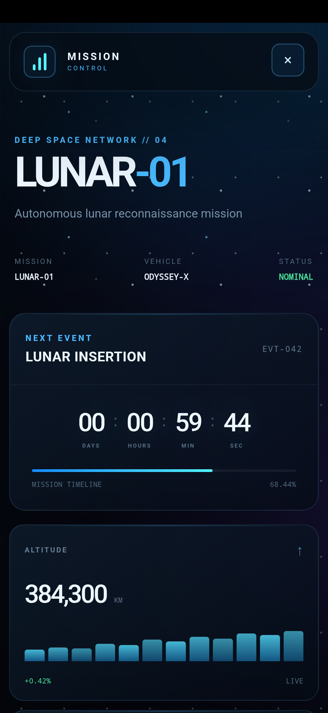

<div align="center">

# 🚀 LUNAR-01 // MISSION CONTROL

### Centro di controllo per missione aereospaziale

Un'interfaccia web immersiva in stile *sci-fi* che simula la sala controllo di una missione lunare: countdown al lancio, telemetria in tempo reale, radar di tracciamento e visualizzazione 2D dell'astronave, tutto racchiuso in un'unica pagina HTML.


</div>

---

## 📡 Indice

- [Panoramica](#-panoramica)
- [Anteprima](#-anteprima)
- [Funzionalità](#-funzionalità)
- [Struttura del progetto](#-struttura-del-progetto)
- [Come avviarlo](#-come-avviarlo)
- [Design system](#-design-system)
- [Roadmap](#-roadmap)
- [Contribuire](#-contribuire)
- [Licenza](#-licenza)
- [Autore](#-autore)

---

## 🌌 Panoramica

**Lunar-01** è un dashboard front-end pensato per simulare — con un forte impatto visivo — il *mission control* di un lancio spaziale. Il progetto è realizzato interamente in un singolo file `index.html`, senza dipendenze da framework esterni: un'unica pagina che combina HTML, CSS e JavaScript per ricreare l'estetica di una console NASA/SpaceX in chiave moderna e minimale (dark UI, accenti neon, tipografia tecnica).

L'obiettivo del progetto è puramente estetico/dimostrativo: un esercizio di UI design avanzato per esplorare animazioni CSS, layout a pannelli e micro-interazioni in un contesto "aerospaziale".

## 🖼️ Anteprima

> 💡 Consiglio: aggiungi qui uno o più screenshot/GIF della dashboard in azione.
>
> ```markdown
> 
> ```

## ✨ Funzionalità

| Modulo | Descrizione |
|---|---|
| 🛰️ **Topbar & Mission Status** | Barra superiore con logo, stato missione live (indicatore pulsante) e orologio UTC in tempo reale |
| ⏱️ **Countdown al lancio** | Contatore T-minus animato (giorni / ore / minuti / secondi) con barra di avanzamento della missione |
| 📊 **Pannelli di telemetria** | Griglia di card con metriche chiave (velocità, altitudine, carburante, temperatura) corredate da mini-grafici animati |
| 🎯 **Radar di tracciamento** | Radar circolare animato con anelli concentrici, sweep rotante e target lampeggianti in tempo reale |
| 🛸 **Visualizzazione astronave** | Rendering 2D dell'astronave in CSS puro, con orbite, finestrino, pannelli e propulsori con effetto fiamma animato |
| ⛽ **Indicatori di sistema** | Barre di livello carburante, scala termica e stato dei sistemi di bordo |
| 🌠 **Sfondo dinamico** | Starfield multi-livello con parallasse, griglia prospettica e bagliori (glow) colorati per profondità visiva |
| 📱 **Layout responsive** | Grid fluida che si adatta a schermi desktop e mobile |

## 🗂️ Struttura del progetto

```
Lunar-01/
└── index.html   # Intera applicazione: markup, stili (CSS variables) e logica (JS) in un unico file
```

Il file `index.html` è organizzato internamente in blocchi commentati e ben separati:

```
├── <style>
│   ├── Variabili di tema (:root)
│   ├── Background & Stars
│   ├── Topbar
│   ├── Mission Header
│   ├── Panels (base)
│   ├── Countdown
│   ├── Telemetry Grid
│   ├── Control Grid (Radar + Spacecraft)
│   └── Responsive breakpoints
├── <body>
│   ├── Background layers (stars, glow, grid)
│   ├── Topbar (brand, stato missione, orologio)
│   ├── Mission Header (titolo, meta-dati missione)
│   ├── Countdown panel
│   ├── Telemetry cards
│   └── Control grid (Radar / Spacecraft view)
└── <script>
    └── Logica di aggiornamento orologio, countdown e animazioni dinamiche
```

## ▶️ Come avviarlo

Non è richiesta alcuna installazione, build tool o dipendenza: è una pagina HTML statica.

**Opzione 1 — Apertura diretta**

```bash
git clone https://github.com/Ale-Dantu/Lunar-01.git
cd Lunar-01
```

Apri semplicemente `index.html` nel tuo browser preferito (doppio click o trascinamento nella finestra del browser).

**Opzione 2 — Server locale (consigliato)**

Per evitare limitazioni del browser legate al protocollo `file://`, è consigliabile servire il file tramite un piccolo server locale:

```bash
# Con Python 3
python3 -m http.server 8000

# Oppure con Node.js (pacchetto "serve")
npx serve .
```

Poi apri [http://localhost:8000](http://localhost:8000) nel browser.

**Opzione 3 — GitHub Pages**

Il progetto si presta perfettamente ad essere pubblicato tramite [GitHub Pages](https://pages.github.com/), attivandolo dalle impostazioni del repository (branch `main`, cartella `/root`).

## 🎨 Design system

L'interfaccia adotta una palette scura ad alto contrasto con accenti neon, definita tramite variabili CSS in `:root`:

| Variabile | Colore | Utilizzo |
|---|---|---|
| `--bg` | `#03060c` | Sfondo principale |
| `--panel` | `rgba(8, 18, 31, 0.72)` | Sfondo pannelli (glassmorphism) |
| `--blue` | `#48b9ff` | Accento primario |
| `--cyan` | `#52f4ff` | Accento secondario / evidenziazioni |
| `--green` | `#48e39a` | Stati positivi / online |
| `--yellow` | `#ffd166` | Avvisi |
| `--red` | `#ff5577` | Stati critici |
| `--purple` | `#9b7cff` | Dettagli decorativi |

**Tipografia:**
- `Space Grotesk` — titoli e dati numerici principali (font tecnico/futuristico)
- `Inter` — testo generale
- `monospace` — dati telemetrici, timestamp e coordinate

## 🛣️ Roadmap

- [ ] Collegare i dati di telemetria a valori dinamici/reali (API o simulazione JS)
- [ ] Rendere configurabile la data/ora di lancio del countdown
- [ ] Aggiungere modalità multi-missione (selezione tra più missioni)
- [ ] Estrarre CSS e JS in file separati per una migliore manutenibilità
- [ ] Aggiungere test cross-browser e ottimizzazioni performance (animazioni)
- [ ] Screenshot e demo live nel README

## 🤝 Contribuire

I contributi sono benvenuti! Per proporre modifiche o miglioramenti:

1. Fai un fork del repository
2. Crea un nuovo branch (`git checkout -b feature/nome-feature`)
3. Effettua le modifiche e il commit (`git commit -m "Aggiunge nome-feature"`)
4. Fai push del branch (`git push origin feature/nome-feature`)
5. Apri una Pull Request

Per bug o suggerimenti, apri pure una [issue](https://github.com/Ale-Dantu/Lunar-01/issues).

## 👤 Autore

**Ale-Dantu**
GitHub: [@Ale-Dantu](https://github.com/Ale-Dantu)

**Francex**
Github: [@Francex](https://github.com/RonyxDumb)

---

<div align="center">

*Realizzato con 🖤 e tanto caffè, guardando le stelle.* ✨

</div>
